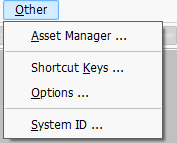
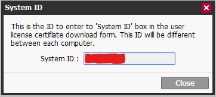

# saicrack
PaintTool SAI Software Crack

If you want to download the latest software package, please go to the official website to download.

https://www.systemax.jp/en/sai/devdept.html

## Requirements
Python - You can find the download here: https://www.python.org/downloads

## Instructions

Put saicrack.py and sai2.exe in the same directory.

Run saicrack.py, you will be prompted to enter the system ID.

(Press Right Click in an empty space in the folder > Open CMD or Right Click the saicrack.py > Open With > Python)

Open SAI2 and press Other > System ID ...

This should open a POP-UP with the system ID!

Help:

Enter the system ID displayed in SAI2 into the CMD, and then press Enter.

Follow the prompts to exit the running SAI2, type OK in the CMD, and then press Enter.

You may now close the enter once the prompt appears to press enter!

Congratulations!

## Instructions
www.painttoolsai.cn is an unauthorized seller of our products. We have never authorized anyone to sell our products.

This unauthorized seller buys official licenses for our products and resells one license cheaply to multiple customers for an unfair profit. This action violates the prohibited items in the license agreement of our products.

We will revoke any illegally distributed licenses as soon as we find them.

Please do not buy our products from unauthorized sellers.

## Notice
It is recommended to download sai2 from https://www.systemax.jp/en/sai/devdept.html
